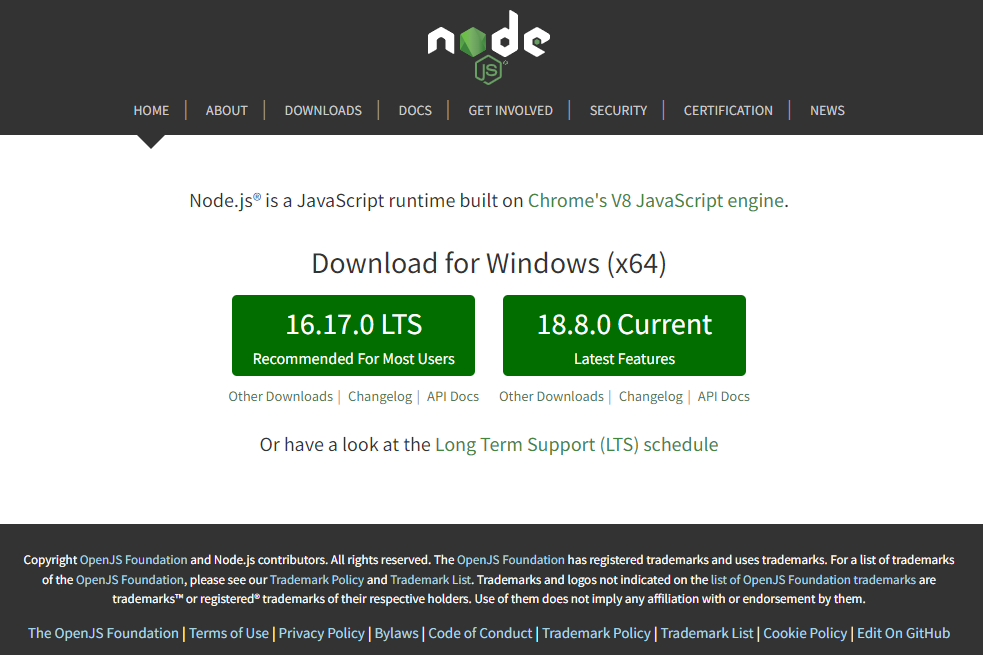
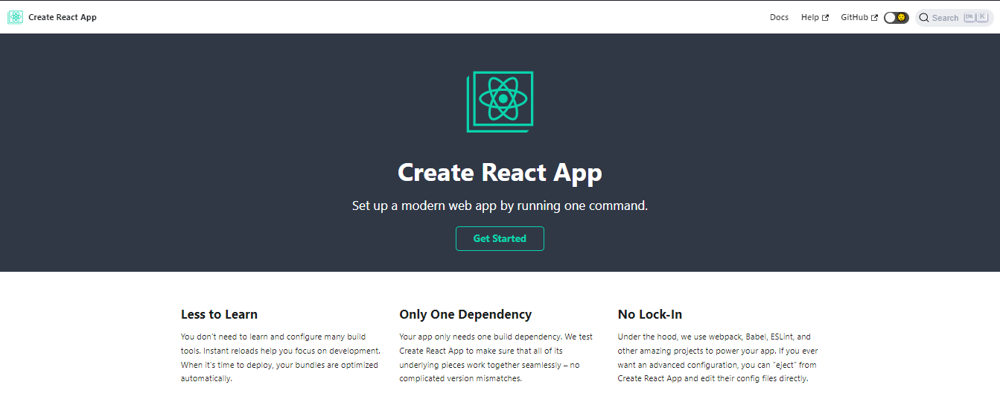

# REACT JS DASAR
## Introduction
React JS adalah framework view library Javascript untuk membuat tampilan pada website. React JS dibuat oleh Tim Engineer Facebook dan digunakan pada sisi front-end. Menurut Google Trends, React JS masih unggul di antara framework Javascript lainnya seperti Vue dan Angular.

Bberapa keunggulan dari React JS adalah sebagai berikut:

1. Membuat aplikasi front-end menjadi lebih cepat walaupun harus menghandle berbagai data. 
2. Bisa diterapkan konsep Modular Javascript. React JS membagi tampilan pada website menjadi komponen-komponen kecil.
3. Dapat digunakan pada aplikasi berskala kecil hingga besar dan kompleks.

### Instalasi React JS
#### Install Node JS

https://nodejs.org

#### Gunakan Library `create-react-app`

https://create-react-app.dev

